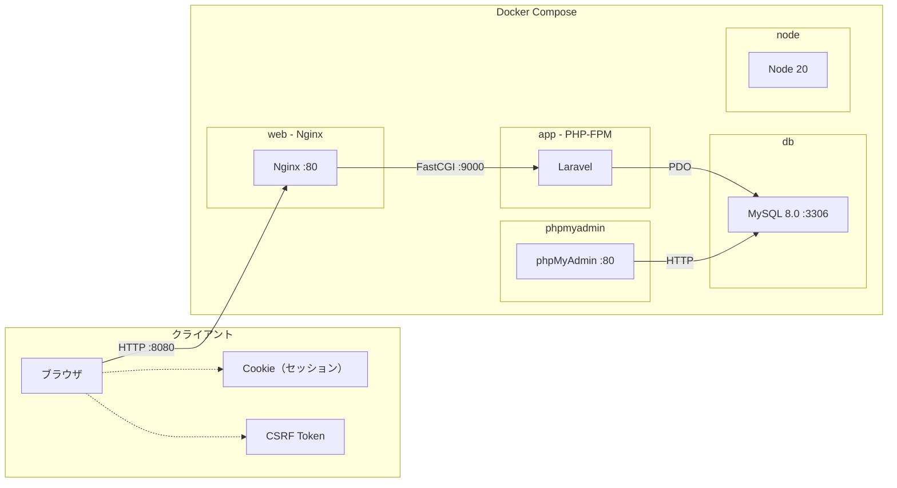
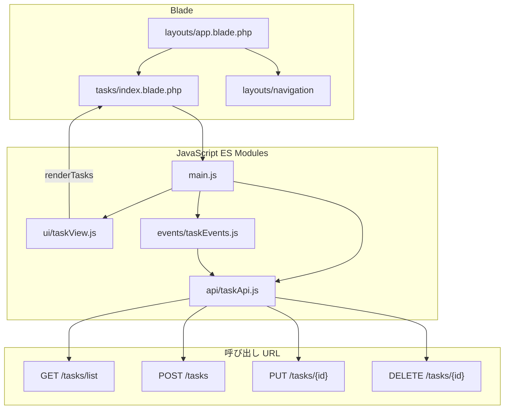
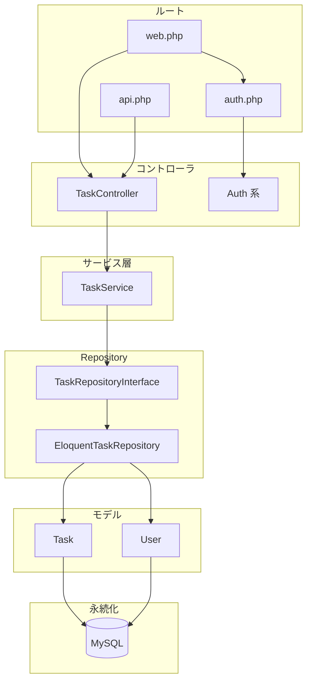
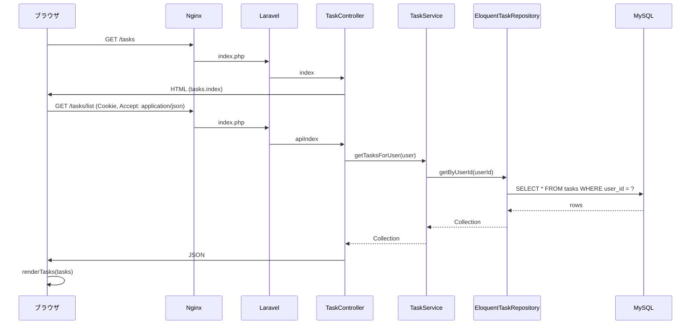
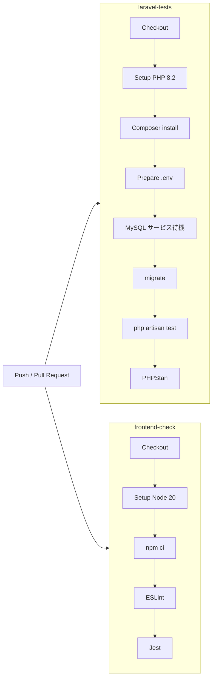

# タスク管理アプリ 構成図

本ドキュメントでは、タスク管理アプリのシステム全体・アプリケーション層・データフロー・CI の構成を図で示します。

---

## 1. システム全体構成図

クライアントから Docker コンテナ群までの構成です。ブラウザはポート 8080 で Nginx に接続し、Nginx が PHP リクエストを app コンテナ（PHP-FPM）に渡します。Laravel アプリは MySQL（db）に接続してデータを永続化します。

| コンテナ | 役割 | ポート（ホスト） |
|----------|------|------------------|
| web | Nginx。`/` を `public/` にマッピングし、`.php` を app:9000 に転送 | 8080 → 80 |
| app | PHP-FPM。Laravel（`public/index.php` → `bootstrap/app.php`） | - |
| db | MySQL 8.0。DB: task_manager | 3306 |
| node | Node 20（npm / Vite 等の開発用） | - |
| phpmyadmin | phpMyAdmin（DB 管理） | 8081 → 80 |

---

## 2. アプリケーション層の詳細図

### 2.1 フロントエンド

Blade で描画したタスク画面に、ES Modules の JavaScript が読み込まれ、Fetch API で Web ルート（`/tasks/list`, POST/PUT/DELETE `/tasks`）を呼び出します。

- **main.js**: 起動時に `TaskApi.getAll()` → `renderTasks(tasks)`、`initTaskEvents()` で追加・保存・削除のイベントを登録。
- **taskApi.js**: `BASE_URL = "/tasks"`。一覧は `/tasks/list`、CRUD は `/tasks`。`X-CSRF-TOKEN` と `credentials: "same-origin"` でセッション認証。
- **taskView.js**: `renderTasks(tasks)` で `#task-list` にテーブル行を描画。
- **taskEvents.js**: 追加ボタン → `TaskApi.create` → 一覧再取得・再描画。保存/削除ボタン → `TaskApi.update` / `TaskApi.delete`。

### 2.2 バックエンド

ルートは `web.php`（タスク画面・タスク API 的エンドポイント）、`api.php`（`/api/tasks` 系）、`auth.php`（ログイン・登録・ログアウト等）に分かれます。タスク機能は Repository パターンで TaskController → TaskService → TaskRepository → Model → MySQL の流れです。

| レイヤー | 主な役割 |
|----------|----------|
| **web.php** | `GET /tasks`（HTML）, `GET /tasks/list`（JSON）, `POST/PUT/DELETE /tasks`。いずれも `auth` ミドルウェア。 |
| **api.php** | `GET/POST/PUT/DELETE /api/tasks`。同じ TaskController メソッドを `/api` プレフィックスで提供。 |
| **auth.php** | ゲスト: register, login, forgot-password, reset-password。認証済: verify-email, logout, password 更新等。 |
| **TaskController** | index（ビュー返却）, apiIndex（JSON）, store, update, destroy。Request 検証・TaskService 呼び出し。 |
| **TaskService** | getTasksForUser, createTask, updateTask, deleteTask。ユーザー紐づけと Repository 呼び出し。 |
| **EloquentTaskRepository** | getByUserId, createForUser, findForUser, update, delete。Task モデル経由で DB アクセス。 |

---

## 3. データフロー図（タスク一覧取得の例）

ログイン済みユーザーがタスク一覧画面を開いたときの流れです。

1. **GET /tasks**: Blade の `tasks.index` が返り、その中で `main.js` が読み込まれる。
2. **GET /tasks/list**: 同一オリジンで Cookie（セッション）が送られ、認証済みユーザーのタスク一覧が JSON で返る。
3. **renderTasks(tasks)**: 受け取った配列で `#task-list` のテーブルを描画する。

---

## 4. CI パイプライン図

GitHub Actions では、Push/PR 時に `laravel-tests` と `frontend-check` が並列で実行されます。

| ジョブ | 内容 |
|--------|------|
| **laravel-tests** | PHP 8.2、Composer、MySQL サービス、`.env`（CACHE_STORE=array, SESSION_DRIVER=array 等）、マイグレーション、Feature/Unit テスト、PHPStan。 |
| **frontend-check** | Node 20、`npm ci`、ESLint（`public/js`）、Jest（`public/js/__tests__/`）。 |

CI 用の詳細は [../.github/workflows/ci.yml](../.github/workflows/ci.yml) を参照してください。
